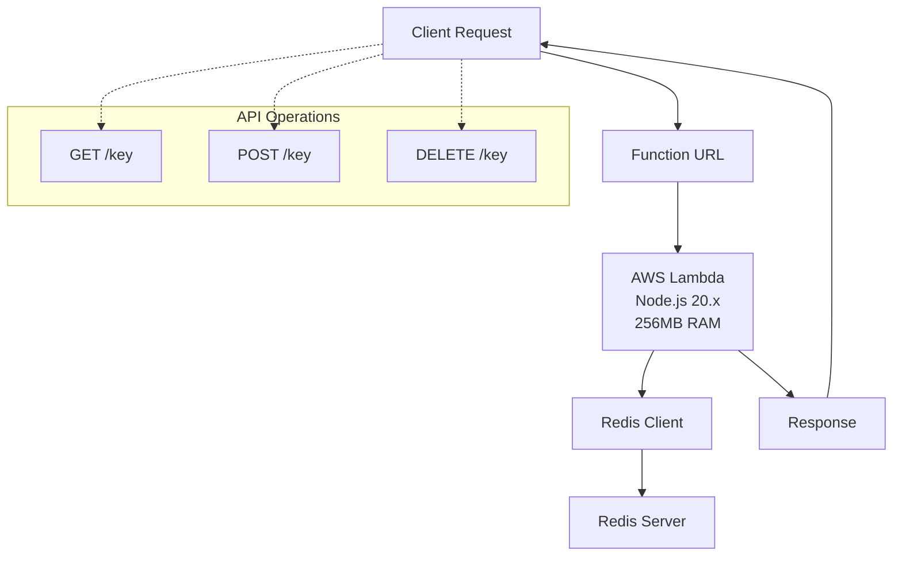

# :shipit: Redis API Lambda

[](https://aws.amazon.com/cdk/)
[](https://aws.amazon.com/lambda/)
[](https://redis.io/)
[](https://www.typescriptlang.org/)
[](LICENSE)

A CDK TypeScript project that creates a Lambda-based Redis API supporting both string and hash operations with GET, SET, and DELETE methods.

## Architecture



## Features

### String Operations

* **GET** `/{key}` - Retrieve a string value by key
* **POST** `/{key}` - Set a string value for a key (value in request body)
* **DELETE** `/{key}` - Delete a key-value pair

### Hash Operations  

* **GET** `/{key}?type=hash&field={field}` - Retrieve a specific field from a hash
* **POST** `/{key}?type=hash` - Set a field-value pair in a hash (field and value in request body)
* **DELETE** `/{key}?type=hash&field={field}` - Delete a specific field from a hash

### Additional Features

* Lambda Function URL with CORS enabled
* Node.js 20.x runtime with 256MB memory
* Environment variables loaded from `.env` file
* Redis connection with username/password authentication support
* Support for both Redis strings and hash data types

## Setup

1. Configure your Redis connection in `.env`:

```env
REDIS_HOST=your-redis-host
REDIS_PORT=6379
REDIS_USERNAME=your-username
REDIS_PASSWORD=your-password
REDIS_DB=0
```

2. Install dependencies:

```bash
npm install
cd lambda && npm install
```

3. Deploy the stack:

```bash
npx cdk deploy
```

## Usage

After deployment, you'll get a Function URL. Use it to make API calls:

### String Operations

#### GET a string value

```bash
curl https://your-function-url.lambda-url.region.on.aws/mykey
```

#### SET a string value

```bash
curl -X POST https://your-function-url.lambda-url.region.on.aws/mykey \
  -H "Content-Type: application/json" \
  -d '{"value": "my-value"}'
```

#### DELETE a string key

```bash
curl -X DELETE https://your-function-url.lambda-url.region.on.aws/mykey
```

### Hash Operations

#### GET a hash field

```bash
curl "https://your-function-url.lambda-url.region.on.aws/myhash?type=hash&field=myfield"
```

#### SET a hash field

```bash
curl -X POST "https://your-function-url.lambda-url.region.on.aws/myhash?type=hash" \
  -H "Content-Type: application/json" \
  -d '{"field": "myfield", "value": "my-hash-value"}'
```

#### DELETE a hash field

```bash
curl -X DELETE "https://your-function-url.lambda-url.region.on.aws/myhash?type=hash&field=myfield"
```

## API Response Examples

### String Operations

#### Successful GET

```json
{
  "key": "mykey",
  "value": "my-value"
}
```

#### Successful SET

```json
{
  "message": "Value set successfully",
  "key": "mykey",
  "value": "my-value"
}
```

#### Successful DELETE

```json
{
  "message": "Key deleted successfully",
  "key": "mykey"
}
```

### Hash Operations

#### Successful Hash GET

```json
{
  "key": "myhash",
  "field": "myfield",
  "value": "my-hash-value"
}
```

#### Successful Hash SET

```json
{
  "message": "Hash field set successfully",
  "key": "myhash",
  "field": "myfield",
  "value": "my-hash-value"
}
```

#### Successful Hash DELETE

```json
{
  "message": "Hash field deleted successfully",
  "key": "myhash",
  "field": "myfield"
}
```

### Error Responses

#### Key/Field Not Found

```json
{
  "error": "Key not found",
  "key": "nonexistent"
}
```

```json
{
  "error": "Field not found in hash",
  "key": "myhash",
  "field": "nonexistent"
}
```

#### Missing Parameters

```json
{
  "error": "Field is required for hash GET operation"
}
```

## Development Commands

* `npm run build` - Compile TypeScript to JS
* `npm run watch` - Watch for changes and compile
* `npm run test` - Perform the Jest unit tests
* `npx cdk deploy` - Deploy this stack to your default AWS account/region
* `npx cdk diff` - Compare deployed stack with current state
* `npx cdk synth` - Emits the synthesized CloudFormation template
